## Build a CDK pipeline for B/G deployments of Single Page Applications (SPAs)

Many Customers have a use case of building [single-page application](https://en.wikipedia.org/wiki/Single-page_application)(SPA) based web apps to lower frontend complexity and provide a standardized development. We will see how to automate the process of creating pipeline infrastructure and hosting the web components on AWS using CloudFront and S3. This solution also shows how to deploy the web apps using B/G deployment with the help of various AWS technologies.

This blog post explains how to build a CDK pipeline for B/G deployments of VueJs WebComponents.  The CDK stack consists of a CloudFront distribution with S3 bucket as an origin to host the VueJS bundle and a code pipeline to deploy the app from a Github repository. The stack also consist of a Lambda@edge function to perform A/B testing and route users to serve the content of website based on B/G deployment. In this post, we are using VueJs framework for web app but you can use any other framework based on your business needs.

### Benefits of B/G deployment

Customers want to automate the end-to-end deployment workflow and leverage continuous methodologies utilizing AWS developer tools services for performing a blue/green deployment with zero downtime. A blue/green deployment is a deployment strategy wherein you create two separate, but identical environments. One environment (blue) is running the updated application version, and one environment (green) is running the current application version. The blue/green deployment strategy increases application availability by generally isolating the two application environments and ensuring that spinning up a parallel green environment won’t affect the blue environment resources. This isolation reduces deployment risk by simplifying the rollback process if a deployment fails.

In this blog post, We will guide you through an automated process to deploy a single-page-application (SPA) on Amazon CloudFront and S3 to host application source code, and utilizing a blue/green deployment with AWS code suite services in order to deploy the application source code with no downtime.

### Architecture design

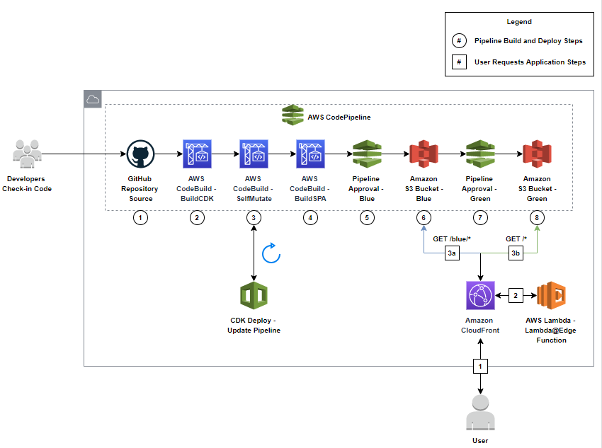

**Pipeline Build and Deploy Steps**

1. Developer makes commit to GitHub triggering AWS CodePipeline.
2. AWS CodeBuild job runs to build CDK code and generate CloudFormation artifacts.
3. AWS CodeBuild job runs to deploy CDK CloudFormation stacks. This stage will self-mutate this infrastructure pipeline with the CDK folder’s updates.
4. AWS CodeBuild job runs to build Vue code and generate application artifact.
5. Approve deployment to "Blue" S3 bucket origin to begin A/B testing the new build.
6. AWS CodePipeline deploys Vue application artifact to "Blue" S3 bucket origin.
7. Once the "Blue" deployment has been verified, approve deployment to "Green" S3 bucket origin.
8. AWS CodePipeline deploys Vue application artifact to "Green" S3 bucket origin and both environments are now synchronized.

**User Requests Application Steps**

1. User requests file from Amazon CloudFront distribution.
2. CloudFront ViewerRequest triggers Lambda@Edge function to determine which origin to forward the user to.
    1. For new users, a cookie will be randomly assigned to determine the version that the user will be forwarded to. There is a 25% chance the "Blue" origin is selected.
    2. When a user already has a valid cookie, the origin will be automatically determined.
3. Cache "Blue" origin content into CloudFront distribution.
4. Cache "Green" origin content into CloudFront distribution.

### Prerequisite

To follow along with this post, you need the following prerequisites:

1. Sign up for an [AWS account](https://aws.amazon.com/).
2. Sign up for [Github account](https://github.com/join).
3. [AWS CDK](https://docs.aws.amazon.com/cdk/latest/guide/getting_started.html).
4. [Install the AWS CLI](https://docs.aws.amazon.com/cli/latest/userguide/install-cliv2.html) and set up your [AWS credentials for command-line use](https://docs.aws.amazon.com/cdk/latest/guide/getting_started.html#getting_started_prerequisites).
5. [Download and Install nodejs](https://nodejs.org/en/download/).

### Getting Started

To implement the architecture described above, we will be doing the following:


1. Cloning the github repository.
2. Storing a new secret using AWS Secrets Manager.
3. Deploy the CDK and Web App using the code cloned from repository.
4. Test the B/G deployment and run the application.

## Setting up

### **GitHub Setup**

1. [Fork](https://docs.github.com/en/get-started/quickstart/fork-a-repo) this GitHub repo and clone to your local machine: https://github.com/aws-samples/aws-cdk-spa-bg-deployment
2. Create a GitHub access token with admin:repo_hook and repo permissions: https://docs.github.com/en/github/authenticating-to-github/keeping-your-account-and-data-secure/creating-a-personal-access-token
    1. Store the generated token in a temporary secure location for later use.
3. Create a new GitHub repository and take note of the following in the newly created repository:
    1. Repository Owner
    2. Repository Name
    3. Repository Deployment Branch
    4. Repository token (token created in previous step)
    5. Notification Email (email used for deployment notifications)
4. Run the following commands against the locally cloned repository to change the remote origin to the newly created GitHub repository origin and push:
```
git remote set-url origin https://github.com/<RepoOwner>/<RepoName>
git push
```

### **AWS Setup**

1. Login to your AWS account: https://console.aws.amazon.com/console/home
2. Navigate to the AWS Secrets Manager and select “Store a new secret”: https://console.aws.amazon.com/secretsmanager/home

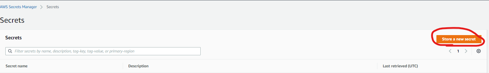

3. Using the GitHub repository information from above, select “Other type of secrets” and enter the following:
    1. repo-owner=Repository Owner
    2. repo-name=Repository Name
    3. repo-branch=Repository Deployment Branch
    4. repo-token=Repository token
    5. notifications-email=Notification Email
4. After confirming all information is correct, leave the encryption key as default and select “Next”. NOTE: This information will be picked by CloudFormation/CDK when the stack is deployed.


5. Set the secret name to “GitHubSecrets” and optionally enter a description and tags for this secret. Select “Next” when you are done.

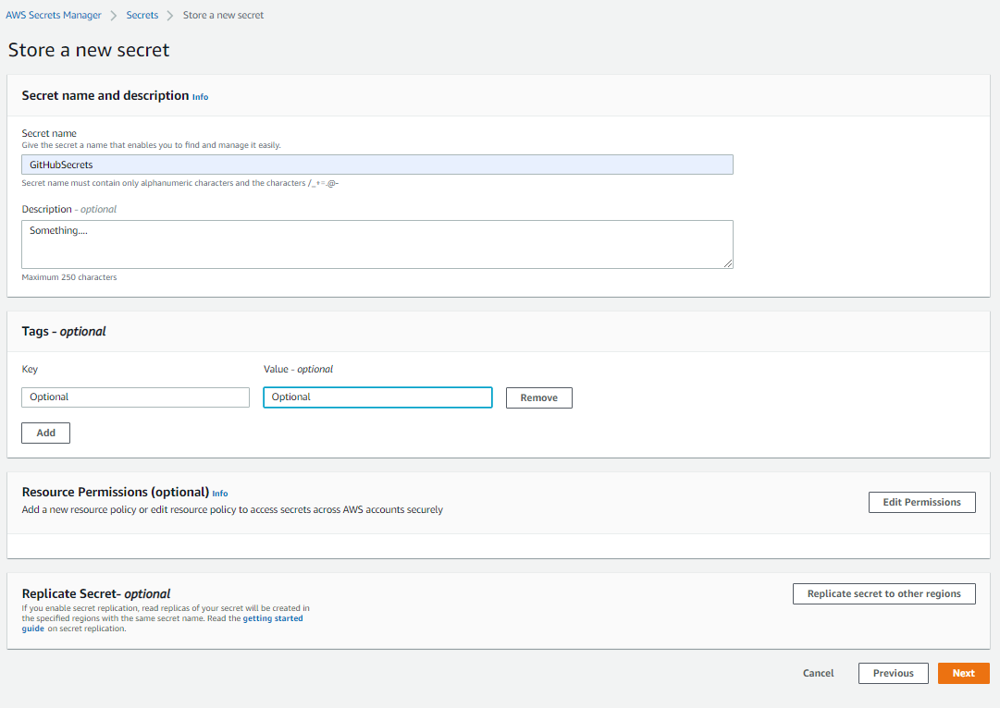

6. Leave “Disable automatic rotation” selected on the next screen and select “Next”. Finally, review the secret and select “Store” on the final page when you are ready.

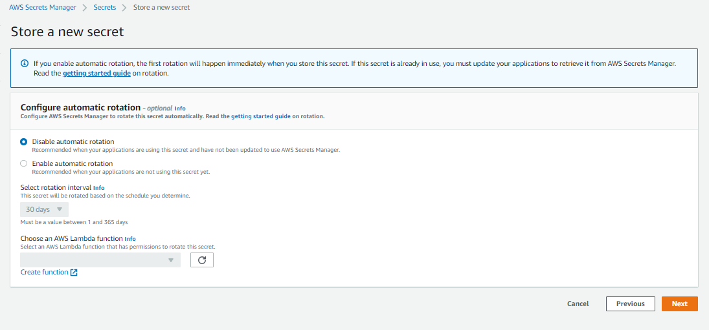

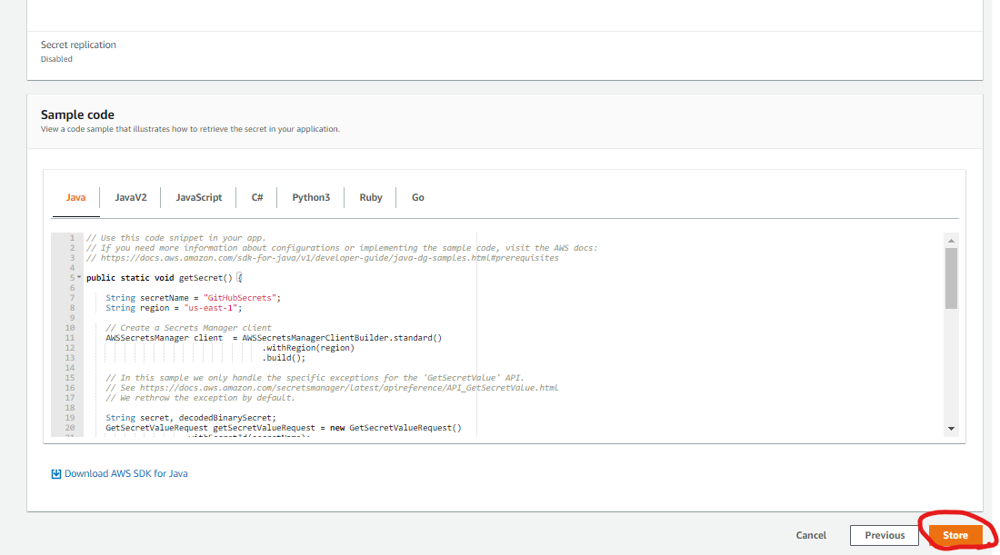

7. From your local machine navigate to the directory which you have cloned the example repository. Change the directory to “cdk”.

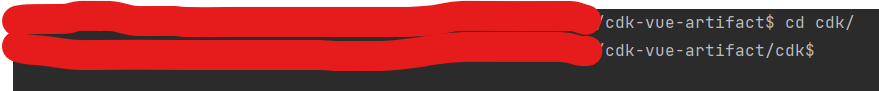

8. Install the NodeJS dependencies, build the application, bootstrap CDK, and deploy the CDK application.
    1. Run `npm install` to install dependencies.
    2. Run `npm run build` to build the CDK application.
    3. Run `npm run bootstrap` to bootstrap the CDK environment.
    4. Run `npm run deploy` to deploy the CDK application stacks to the bootstrapped environment.
    5. NOTE:  The CDK commands that NodeJS is executing behind the scenes are available in the ‘package.json’ file.
9. Once the stack has been deployed you should see a new pipeline in the bootstrapped region as below. NOTE: You should also see the CloudFormation stacks that were deployed by CDK available in the CloudFormation console.

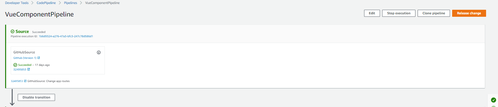

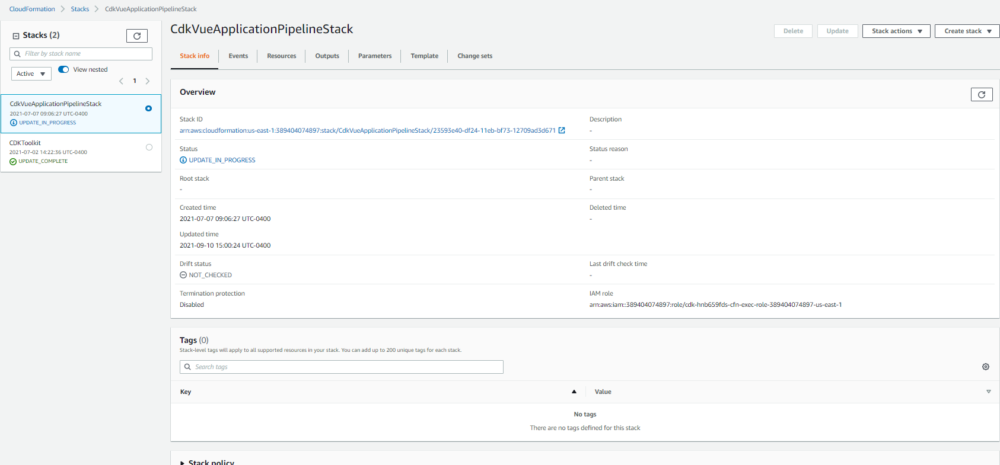

10. Once the CloudFormation stack indicates the status of “UPDATE_COMPLETE”, you may push a change to your GitHub repository to test the pipeline.
11. When the pipeline reaches the stages “ApprovalGreen” and “ApprovalBlue”, you should receive an email notification indicating that your pipeline is awaiting an approval. Once the approvals are reviewed and accepted, the web application will be deployed to the respective S3 origin and all stages should have a green check mark.

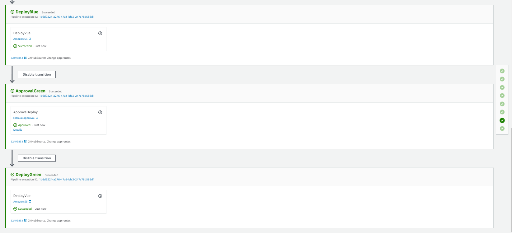

12. To access the deployed web application, navigate to the [CloudFront console UI](https://console.aws.amazon.com/cloudfront/v3/home) and find the generated CloudFront distribution (The origin should contain the name “green-vue-component-bucket”).

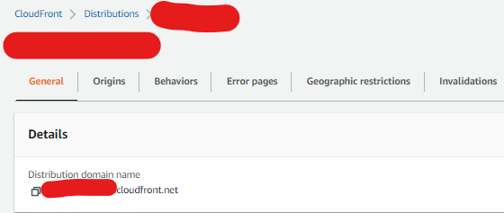

13. Copy the CloudFront distribution’s domain name and navigate to the URL in a separate browser tab. After navigating to the URL, the web application should load into either the blue or green deployment of the application. NOTE: See the “vue-web-component-app” folder to understand the inner details of the deployed web application.


## Test

Once the user visits the CloudFront domain, they will be randomly assigned a cookie name “X-Experiment-Name” with a value of either “A” or “B”. To test that the user can be redirected to both deployments, you can clear the cookie from application cache (using Chrome developer console below) and refresh the page until the desired value is assigned.

**Experiment A (Green)**:
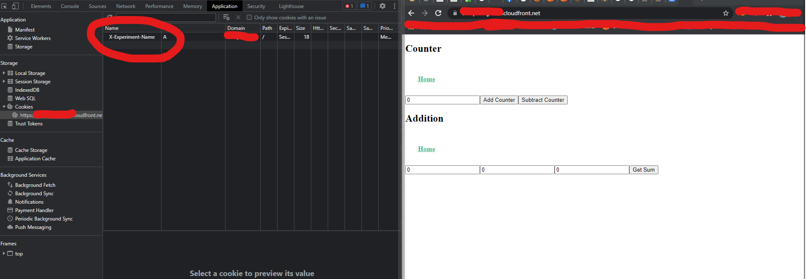

**Experiment B (Blue)**:


## Cleanup

To clean up after this tutorial:

1. Log into the AWS console of the account you used
2. Go to the [AWS CloudFormation console](https://console.aws.amazon.com/cloudformation/home) of the region where you chose to deploy, and select and click ‘Delete’ on the stack named ‘CdkVueApplicationPipelineStack’.
3. You may optionally delete the bootstrapping stack for CDK named ‘CDKToolkit’ if you do not want to be charged for its deployed resources.

## Conclusion

To recap, there is a common use case of building [single-page application](https://en.wikipedia.org/wiki/Single-page_application)(SPA) based web apps to lower frontend complexity and provide a standardized development stack. Using the blue/green deployment strategy with your SPA will increase application availability and ensure that spinning up a parallel green environment won’t affect the blue environment resources. This isolation reduces deployment risk by simplifying the rollback process if a deployment fails and always having a known “good” environment ready to serve users.

## Security

See [CONTRIBUTING](CONTRIBUTING.md#security-issue-notifications) for more information.

## License

This library is licensed under the MIT-0 License. See the LICENSE file.

